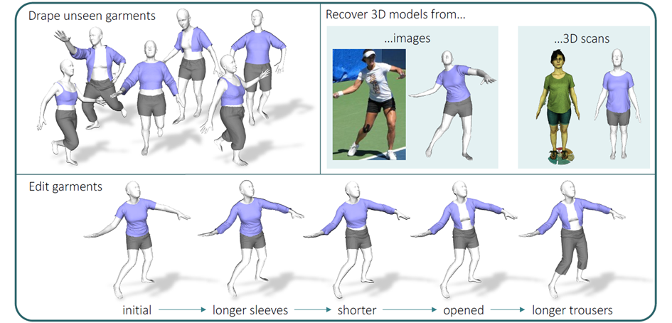

# DrapeNet: Garment Generation and Self-Supervised Draping
<p align="center"></p>

This is the repo for [**DrapeNet: Garment Generation and Self-Supervised Draping**](https://liren2515.github.io/page/drapenet/drapenet.html).

Environment:
* Ubuntu 20.04
* python 3.8.6
* PyTorch 1.13.1 w/ CUDA 11.7

## Setup:
```
python3 -m venv .venv
source .venv/bin/activate
pip install -U pip setuptools
pip install numpy open3d einops hesiod fvcore tensorboard trimesh cython networkx
```

Install `torch` and `pytorch3d`:
```
pip install https://download.pytorch.org/whl/cu113/torch-1.12.0%2Bcu113-cp38-cp38-linux_x86_64.whl
pip install --no-index --no-cache-dir pytorch3d -f https://dl.fbaipublicfiles.com/pytorch3d/packaging/wheels/py38_cu113_pyt1120/download.html
```

Build and install `meshudf`:
```
cd meshudf
source setup.sh
```

Download the female SMPL model from http://smplify.is.tue.mpg.de/ and place `basicModel_f_lbs_10_207_0_v1.0.0.pkl` in the folder of `./smpl_pytorch`.

## Encoder-Decoder:
```
cd encdec
python3 preprocess_udf.py </path/to/meshes> </out/path>
python3 train_encdec.py  # add </path/to/run/cfg/file> to restore training
python3 export_codes.py </path/to/run/cfg/file>
python3 export_meshes.py </path/to/run/cfg/file>
```

## Editing:
```
cd editing
python3 create_dset.py
python3 compute_weights.py
python3 edit.py
```

## Draping:
```
cd draping
python3 drape.py
```

## Citation
If you find our work useful, please cite it as:
```
@inproceedings{de2023drapenet,
  author = {De Luigi, Luca and Li, Ren and Guillard, Benoit and Salzmann, Mathieu and Fua, Pascal},
  title = {{DrapeNet: Garment Generation and Self-Supervised Draping}},
  booktitle = {Proceedings of the IEEE/CVF Conference on Computer Vision and Pattern Recognition},
  year = {2023}
}
```

Our work is built upon [MeshUDF](https://github.com/cvlab-epfl/MeshUDF). If you find it helpful, please cite it properly as well.